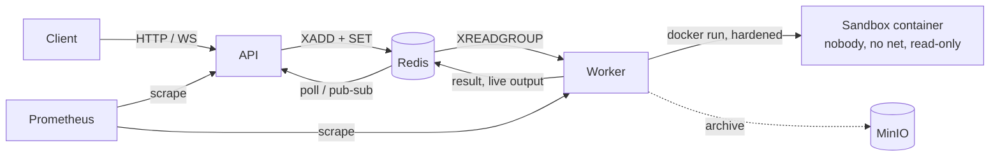

# Overview

## What it is

A self-hosted service that runs **untrusted source code** (Python, JavaScript, TypeScript, Java,
Go, Ruby, Rust, Bash) and returns `stdout`, `stderr`, exit status and resource metrics. A caller
submits code over HTTP (sync or async) or a WebSocket (live output); a pool of workers runs each
submission in a fresh, locked-down Docker container and discards it afterwards.

It is the building block behind "run this code" buttons in AI assistants, online judges and
notebooks, built to be understood end to end: ~2.7k lines of TypeScript (API), ~2.7k lines of
Python (worker and sandbox engine), eight small Dockerfiles, and the monitoring and CI around them.

## The problem

Executing arbitrary code is the textbook way to lose a server. A useful code-execution service must
simultaneously:

1. **Contain** the code - no host file access, no network, no privilege, no persistence between
   runs, no interference between tenants.
2. **Bound** it - CPU, memory, processes, disk, output and wall time are all finite, and a job that
   exceeds any of them dies without hurting its neighbours.
3. **Serve it fast enough** - an interactive caller notices hundreds of milliseconds, so the
   isolation machinery cannot dominate latency.
4. **Operate** - queueing, retries, worker death, cleanup, metrics, quotas.

The design answers each with an explicit, inspectable mechanism rather than a framework:
a per-job `docker run` with a fixed flag set ([SANDBOX.md](SANDBOX.md)), a worker-side timeout
ladder, Redis Streams with a consumer group, and Redis-backed rate limits and quotas.

## Architecture in one picture

Details: [ARCHITECTURE.md](ARCHITECTURE.md). Per-file tour: [CODE_WALKTHROUGH.md](CODE_WALKTHROUGH.md).

## Scope

In scope: the isolation executor, queueing, auth and limits, metrics/dashboards/alerts, CI,
benchmarks. Out of scope: multi-host scheduling, per-tenant billing, a UI, persistent notebooks or
stateful sessions, package installation inside sandboxes, network egress.

## Known gaps

These are things a reader might assume exist but do not (all verified in code; none are hidden in
the README any more):

| Gap | Detail |
|---|---|
| Tracing | The API creates a W3C `traceparent` and puts it in the job payload; the worker never reads it and OTLP export is not implemented (spans are debug log lines). `OTEL_EXPORTER_OTLP_ENDPOINT` therefore does nothing. |
| Output files | `ExecutionResult.files` is always `[]`; MinIO only stores a JSON archive of each result, which nothing reads back. |
| User-namespace remapping, gVisor, socket proxy, egress proxy, signature verification at run time | Mentioned as design intent or optional hardening; not implemented ([THREAT_MODEL.md section 5](THREAT_MODEL.md#5-implementation-status-of-controls-claimed-elsewhere)). |
| Seccomp for TypeScript/Go/Rust | Block-list, not allow-list. |
| Two language registries | `api/src/languages.ts` and the worker registry are kept in sync by hand. |
| Sync timeout (`408`) | Does not cancel the job. |
| Cancel race | `DELETE` rewrites the record with a read-modify-write that could overwrite a result stored in the same instant. |
| Duplicate execution | At-least-once; a worker stalled for >60 s mid-job can have its entry reclaimed and re-run. |
| k6 load test | Present (`tests/e2e/load_test.js`) but not run by this audit (k6 unavailable). The benchmark harness has its own generator. |
| Concurrency | `RLIMIT_NPROC` is per host uid, so it is not a per-sandbox control; the cgroup PID limit is. |

## Audit summary

This branch (`benchmark-and-docs`) is the result of a code audit, a benchmark campaign and a
documentation pass over the repository at `main` (`b85638f`). Test runs: Python unit 130 -> 144
passing, TypeScript 107 -> 118 passing, plus 9 new real-kernel seccomp tests and 1 new
real-container signal test; the 49 existing
real-Docker integration and escape tests all passed. CI on `main` was green; the nightly
Security workflow had been failing since it was added.

| # | Severity | Where (at `b85638f`) | Problem | Fix |
|---|---|---|---|---|
| 1 | High | `api/src/routes/execute.ts:97,150`, `jobs.ts:40,73`, `health.ts` | Async handlers were `void (async () => ...)()` with no catch: any rejection (Redis down, breaker open) became an unhandled rejection and the HTTP request **never got a response**; the documented 503 could never be returned. | `4483cb0` `asyncHandler`; 503 for dependency errors; 400/413 for body-parser errors (malformed JSON used to be a 500) |
| 2 | High | `worker/queue/consumer.py:109` | `XACK` without `XDEL`: every submission (including full source code) stayed in the stream forever. Redis memory grew without bound (prod sets `noeviction`, so writes would eventually fail) and `sandbox_queue_depth` (`XLEN`) only ever grew, making the `QueueBacklogGrowing` alert permanently fire after 200 jobs. | `bfdbe33` delete on ack; dead-letter stream capped |
| 3 | High | `worker/worker.py:113-119` | Jobs that exceeded `QUEUE_MAX_RETRIES` or had a malformed payload were dead-lettered but the job record was never finalised: pollers saw `PENDING`/`RUNNING` until TTL expiry. A non-dict `request` raised `AttributeError` inside the task, unacked. | `bfdbe33` finalise `FAILED`, release slot; catch `AttributeError` |
| 4 | High | `api/src/services/websocket.ts` | The WebSocket streaming path skipped the rate limiter and the per-user concurrency quota entirely (a free bypass of both). | `9ec3f61` |
| 5 | Medium | `worker/worker.py:94` | The consume loop read `QUEUE_READ_COUNT` (10) messages while having only `WORKER_CONCURRENCY` (4) slots; the surplus sat delivered-but-idle in the PEL where another worker's `claim_stale` (60 s) steals it, running a job twice. | `bfdbe33` read at most the number of free slots |
| 6 | Medium | `worker/sandbox/executor.py:344` | After `SIGKILL` the executor did `await proc.wait()` unbounded; if `docker kill` found no container (kill racing creation) the pool slot hung. | `bfdbe33` bounded wait + `rm -f` + kill client |
| 7 | Medium | `api/src/middleware/rateLimiter.ts:114` | `clientIp` trusted the left-most `X-Forwarded-For` entry, which is client controlled, so the per-IP bucket could be minted anew per request. | `9ec3f61` use `req.ip` (trust proxy 1) |
| 8 | Medium | `api/src/middleware/auth.ts:95` | API-key principal id was a 32-bit FNV hash: colliding keys share quota, rate limit and job ownership. | `44d3f4f` SHA-256 prefix |
| 9 | Medium | `api/src/telemetry/metrics.ts:36` + worker | Same metric name and labels (`sandbox_executions_total`) exported by API and worker: sync jobs double-counted on every dashboard panel and in the failure-rate alert. | `7b0a312` rename API metric |
| 10 | Medium | `docker-compose.prod.yml:11` | `ports: []` is merged with the base file, so "production" still published Redis 6379 and MinIO 9000/9001. | `5ca442f` `!reset` |
| 11 | Medium | `worker/sandbox/cleanup.py:145` | The reaper removed `Created` containers immediately; that is the normal momentary state of a job's container, so the reaper could race a starting job. | `bfdbe33` age-gate `Created` |
| 12 | Low | `worker/telemetry/metrics.py:24` | `sandbox_container_startup_seconds` was never recorded; its alert and dashboard panels were dead. | `bfdbe33` |
| 13 | Low | `api/src/services/websocket.ts:124,142` | `activeWebsockets` was decremented twice per normal stream (finish + close). | `9ec3f61` idempotent cleanup |
| 14 | Low | `worker` (concurrency slot) | Async jobs never released their concurrency slot on completion (only on sync completion/cancel), so the quota was effectively "N submissions per 40 s". | `bfdbe33` worker releases the slot |
| 15 | Low | `api/Dockerfile:11` | `npm install` without the lockfile: unpinned transitive dependencies in the production image. | `5ca442f` `npm ci` |
| 16 | Low | `.github/workflows/security.yml` | Nightly workflow failing: `aquasecurity/trivy-action@0.28.0` tag does not exist (`v0.28.0`), and ZAP could not create an issue (`Resource not accessible by integration`). | `58bb98d` |
| 17 | Low | `docker-compose.yml` worker | Compose's default 10 s stop timeout kills a draining worker mid-job. | `b337cb7` `stop_grace_period: 45s` |
| 18 | Low | `tests/integration/test_executor_real_docker.py` | `assert ... or True` - an assertion that could never fail. | `39ef2e5` strengthened |
| 19 | Medium | `api/src/config.ts` / `docker-compose.yml` | `MINIO_ENDPOINT=minio:9000` is shared by API and worker, but the MinIO JS client throws `Invalid endPoint` for `host:port` (reproduced with `new Client({endPoint:'minio:9000'})`), so `/v1/health` reported `minio: down` in the default stack. | `1ef6e54` accept both forms |
| 20 | Doc | README, `SECURITY.md`, `ARCHITECTURE.md`, `API.md`, `RUNBOOK.md` | Claims not backed by code (user namespaces, digest-pinned+signed images always verified, gVisor, allow-list seccomp for all languages, default timeout 30, `BASH_SYSCALLS`, trace propagation, result files). | Corrected; see THREAT_MODEL section 5 |
| 21 | Medium | `worker/sandbox/executor.py` (`_build_command`) | No `--init`: the interpreter was PID 1 and ignored `docker kill --signal=TERM` (reproduced with a Python spin loop and `sleep`), so the TERM->KILL ladder degraded to KILL-after-grace and every timeout overshot by `SIGTERM_GRACE_SECONDS`. | `2ba4387` `--init` |
| 22 | Medium | `worker/sandbox/executor.py` (`_pump`) | Each 64 KiB read was UTF-8 decoded independently with `errors="replace"`; a multi-byte character straddling two reads (any large non-ASCII output) turned into U+FFFD in `stdout`/`stderr` and the live stream. | `6c2a9b2` incremental decoder |
| 23 | Low | `api/src/app.ts` (request metrics) | Unmatched requests used the raw path as the `route` label, so a client could create unbounded Prometheus series (memory growth in the API and in Prometheus). | `6d53524` `route="unmatched"` |
| 24 | Env | `docker-compose.yml` (`minio`, `createbuckets`) | The pinned `minio/minio:RELEASE.2024-11-07T00-52-20Z` and `minio/mc:RELEASE.2024-11-05T11-29-45Z` could not be pulled on 2026-10-04 (Docker Hub: not found / access denied; quay.io: 401), so a fresh `docker compose up` failed: both repositories were removed from Docker Hub. | switched both services to the digest-pinned `cgr.dev/chainguard/minio` image (ships `minio` and `mc`), overridable via `MINIO_IMAGE` |
| 25 | Medium | `Makefile:67`, `.github/workflows/release.yml:67`, `tests/e2e/vitest.e2e.config.ts` | `make test-e2e` and the release workflow's e2e job could never start: the config sat outside any `node_modules` tree, so `vitest/config` could not be resolved (`Cannot find module 'vitest/config'`, reproduced). The Release workflow has never run, so nobody noticed. | `3af75e7` move config to `api/` |
| 26 | Test gap | `tests/security` | Most escape payloads call userspace tools the images do not contain (`mount`, `modprobe`, `unshare`), so "blocked" did not prove the kernel filter. | `39ef2e5` `tests/security/test_seccomp_enforced.py` calls the syscalls directly |

Behavioural findings from running the stack (timeout overshoot, throughput ceiling) are in
[BENCHMARKS.md](BENCHMARKS.md#findings-from-running-the-stack).
