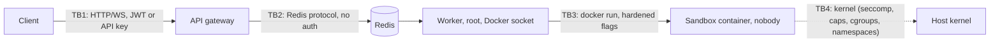

# Threat model

Scope: the code in this repository running as described in `docker-compose.yml`. Method: assets and
trust boundaries first, then each threat with the control that actually exists in the code and
how that was verified. Aspirational controls that older docs mention but the code does not
implement are listed separately in [section 5](#5-implementation-status-of-controls-claimed-elsewhere)
so nobody relies on them by accident.

## 1. Assets and actors

| Asset | Why it matters |
|---|---|
| Host kernel and host root | Everything else is lost if a sandbox escapes. |
| Docker socket in the worker container | Root-equivalent control of the host. |
| Redis | Holds job payloads (source code, stdin), results, rate-limit and quota state, cancel flags. No authentication is configured in compose. |
| MinIO credentials | Result archive. |
| `JWT_SECRET` and `API_KEYS` | Forging them is an impersonation / quota bypass. |
| Other tenants' jobs and results | Read via `GET /v1/jobs/{id}`. |
| Host CPU, RAM, disk, PIDs | Availability. |

Actors: an **anonymous or authenticated API caller** (assumed hostile; controls `language`, `code`,
`stdin`, `env_vars`, `files`, `timeout_seconds`), **code inside a sandbox** (assumed to be
arbitrary native code running as uid 65534), **a network attacker** between client and API, and
**a co-tenant** sharing the platform.

## 2. Trust boundaries

TB4 is the one that matters most and the one this project can only *narrow*, not *prove*: all
sandboxes share the host kernel. See [section 4](#4-residual-risk-and-what-would-reduce-it).

## 3. Threats, controls, evidence

Severity is the impact if the control failed, not likelihood. "Evidence" names a test or code path;
"Verified here" says whether this audit ran it (see [BENCHMARKS.md](BENCHMARKS.md) for the run).

| # | Threat | Control (in code) | Evidence | Residual |
|---|---|---|---|---|
| T1 | Host command execution through the orchestration path | Docker is driven by argv arrays (`asyncio.create_subprocess_exec`); user code goes to a file; filenames pass `_safe_basename` + `realpath` containment | `tests/unit/test_executor*.py`; path-escape tests | The worker parses nothing from user code. Env var *values* are passed as `-e K=V` argv elements, not interpolated. |
| T2 | Read or write host files | `--read-only`, tmpfs `/tmp` `noexec`, only `/sandbox:ro` bind mount, `nobody` | `tests/security/test_escape_attempts.py` (`read_etc_shadow`, `write_root_dir`, `exec_from_tmp_noexec`, ...) | The job directory is host-visible and world-readable (0755/0644) for the duration of the job; another sandbox cannot see it, but a host user can. |
| T3 | Kernel privilege escalation | seccomp (allow-list for 5 languages, block-list for 3), `--cap-drop ALL`, `no-new-privileges`, no user namespace by default | escape suite: `setuid_to_root`, `ptrace_self`, `unshare_userns`, `mount_proc`, `load_kernel_module` | Shared kernel. Unprivileged-reachable kernel bugs in allowed syscalls are not mitigated by this repo. The block-list profiles fail open for syscalls the list does not name. |
| T4 | `/proc`, `/sys`, `/dev` abuse, cgroup `release_agent` | Docker default masks, read-only rootfs, caps dropped, no `--privileged` | `write_sysfs`, `cgroup_release_agent`, `namespace_read_host` | Depends on Docker's default masked-path set. |
| T5 | CPU / memory / PID / disk exhaustion by a sandbox | `--memory` = `--memory-swap`, `--cpus`, `--pids-limit`, tmpfs sizes, `fsize`, wall-clock timeout, 1 MiB output cap | `fork_bomb`, `memory_bomb`, `disk_fill`, `cpu_fork_spin`; timeout tests | `--cpus` is a quota: N concurrent sandboxes can still use `N x quota` CPU. tmpfs counts against the memory limit. A program that installs a SIGTERM handler and ignores it overshoots its timeout by `SIGTERM_GRACE_SECONDS`; programs with default signal handling die on TERM because sandboxes run under `docker --init` (measured, see BENCHMARKS). |
| T6 | Network exfiltration / SSRF / metadata endpoint | `--network=none` for every runtime (no flag turns it on), seccomp omits `socket` for allow-list languages | `tcp_connect_external`, `udp_send`, `http_request`, `dns_lookup` | For TypeScript/Go/Rust `socket()` is permitted by seccomp but there is no interface except loopback. |
| T7 | Supply chain at run time | No package manager in the images; no network; `npm`/`cargo`/`git` removed from some images | Dockerfiles | Images are rebuilt from mutable upstream tags-with-version pins, not digests. Nightly Trivy scan is configured (`.github/workflows/security.yml`; it was failing before this branch, see the audit log in [OVERVIEW](OVERVIEW.md#audit-summary)). |
| T8 | Docker socket reachable from a sandbox | Socket is mounted only into the worker and promtail, never into a sandbox | `docker_socket_access` | **The worker holds the socket.** A bug in the worker is a host compromise. |
| T9 | Queue / payload attacks | zod schema at the API; worker defensively parses (`from_dict`, malformed payloads are dead-lettered and the job finalised `FAILED`) | `tests/unit/test_worker_daemon.py` | **Redis has no password and compose publishes 6379** in dev. Anyone who can reach Redis can enqueue arbitrary jobs, read all code/results, and set cancel flags. Prod overlay (fixed in this branch) unpublishes it. |
| T10 | Output flooding / log forging | 1 MiB cap with truncation flag; JSON logs (control chars escaped); API redacts `code`, `stdin`, auth headers; worker logs metadata only | `_OutputCapture` tests | |
| T11 | Request flooding, quota bypass | Sliding-window limits per user and per IP, payload caps, per-user concurrency quota, circuit breaker; WebSocket path now uses the same limits | `tests/unit/rate_limiter.test.ts`, WS limit tests | **Fails open** if Redis errors (rate limiter and quota). All anonymous callers share one bucket. Per-IP limit is `max(tier, premium)` so it only guards against one IP using many identities. Behind more than one proxy hop `req.ip` is the proxy. |
| T12 | Auth bypass, token theft | HS256 verification with algorithm pinned, constant-time compare, secret length >= 32 and deny-list, API-key identity = SHA-256 prefix | `tests/unit/jwt.test.ts`, `auth.test.ts` | Tokens without `exp` never expire; no revocation; `?token=` query auth for WebSocket puts the JWT in URLs and proxy logs; API keys are plaintext in the environment and compared by Map lookup (not constant time); invalid credentials return 403 rather than 401. |
| T13 | Job enumeration / IDOR | Owner check on `GET`/`DELETE /v1/jobs/{id}`; ULID format guard | `api_server.test.ts` | `403` vs `404` reveals that a ULID exists. ULIDs are time-ordered with 80 bits of randomness, so guessing is impractical, but they are not secret (they appear in logs). |
| T14 | Leaked containers after crashes | `--rm`, `docker rm -f` in `finally`, labelled reaper, stale-entry reclaim | `tests/unit/test_cleanup.py` | A `kill -9`'d worker leaves its sandbox running up to 300 s (timeout is enforced by the worker). |
| T15 | Replay / duplicate execution | Each delivery is claimed via consumer groups; at-least-once | `test_worker_daemon.py` | A job can run more than once if a worker dies after starting it; user code must be treated as idempotent from the platform's view. Slow reads no longer create idle pending entries (fixed here), but a worker that stalls >60 s mid-job can still be double-claimed. |
| T16 | Cross-tenant data leakage via the host | One container per job, `--rm`, no shared writable mounts | design | Kernel and microarchitectural side channels are out of scope. |

## 4. Residual risk and what would reduce it

1. **Shared kernel.** Run workers on dedicated hosts or VMs with a recent kernel; enable
   `userns-remap` or rootless Docker; consider gVisor (`runsc`) or Firecracker. None of these is
   configured by this repository (see section 5).
2. **The worker's Docker socket.** Use rootless Docker for the worker's daemon, or a socket proxy
   that allows only `create/start/wait/kill/rm/inspect`. Not provided here.
3. **Redis exposure.** Put Redis on a private network, set `requirepass`/ACLs (the code reads
   `REDIS_URL`, which supports credentials), and use `rediss://`.
4. **Rate-limiter fail-open.** Acceptable for a single-tenant demo, risky for a public service. The
   alternative (fail-closed) trades availability for strictness; both are one line in
   `SlidingWindowRateLimiter`.
5. **Block-list seccomp for TypeScript/Go/Rust.** Move to an allow-list generated with `strace`
   or `oci-seccomp-bpf-hook` per toolchain if those runtimes are exposed to hostile users.

## 5. Implementation status of controls claimed elsewhere

The README, `SECURITY.md` and `ARCHITECTURE.md` predate this audit. Status of the claims, checked
against the code:

| Claim in older docs | Status | Evidence |
|---|---|---|
| "8 layers... namespaces (PID/NET/MNT/UTS/IPC/USER)" | **USER namespace is not enabled** (Docker default has none). Layers 1-6 are real. | No `--userns` flag in `_build_command`; no daemon config in repo |
| "User-namespace remapping maps nobody to an unprivileged host user" | **Not configured.** Optional daemon hardening. | `grep -r userns` finds only docs and one test payload |
| "Default-deny seccomp allow-lists per language" | **True for python/javascript/java/ruby/bash only.** typescript/go/rust are default-allow block-lists. | `BLOCKLIST_LANGUAGES` in `seccomp.py` |
| "Images pinned by SHA-256 digest and verified before every run" | **Optional and off by default**; works only for images with `RepoDigests` (pulled from a registry). | `_verify_image`; `SANDBOX_DIGEST_*` |
| "Images signed with cosign and verified before run" | **Partly.** `release.yml` signs the API and worker images only; runtime images are pushed unsigned; nothing verifies signatures at run time. | `.github/workflows/release.yml` |
| "gVisor / runsc optional" | **Not implemented.** No runtime flag in the executor. | `grep -ri runsc` finds docs only |
| "Worker talks to Docker through a restricted channel / socket proxy" | **Not implemented.** The raw socket is mounted. | `docker-compose.yml` |
| "Optional egress via allow-list proxy with DNS sinkhole" | **Not implemented.** `network_enabled` is a field but always `False` and no API exposes it. | `resource_limits.py` |
| "API keys hashed at rest" | **No.** Keys live in `API_KEYS`; only the derived principal id is a hash. | `config.ts`, `auth.ts` |
| "HS256/RS256" | **HS256 only.** | `jwt.ts` |
| "Distributed tracing HTTP -> queue -> container; OTLP export" | **Partial.** A W3C `traceparent` is generated and put in the queue payload; the worker never reads it and nothing is exported (debug log only). | `grep traceparent worker/` empty |
| "`files` in the result: produced artifacts (presigned URLs)" | **Not implemented.** Always `[]`. | `executor.py` `_build_result`; `presignArtifact` has no caller |
| "Redis/MinIO ports not published in production" | **False before this branch** (compose merges `ports: []`), fixed with `!reset`. | `docker-compose.prod.yml` |
| "Graceful shutdown drains in-flight jobs" | True for the worker (`_drain`); the API drains only enqueues. | `worker.py`, `index.ts` |
| "`--pids-limit` + nproc" | True; `nproc` is per-uid host-wide so it is not a per-container control. | [SANDBOX.md](SANDBOX.md#36-cgroups-v2-limits) |

The corrected statements are folded into `SECURITY.md`, `ARCHITECTURE.md` and the README.
